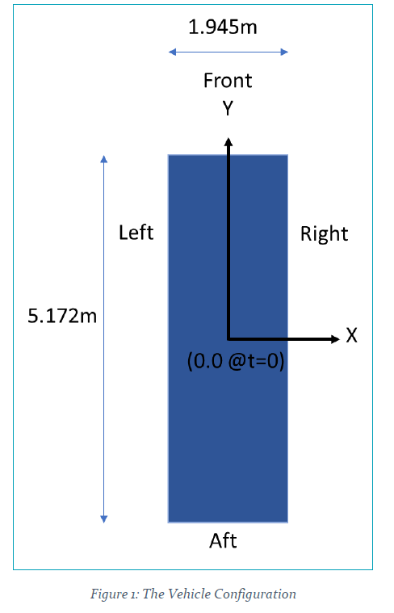
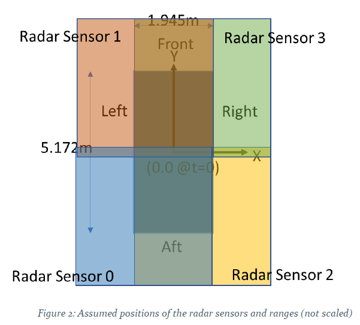
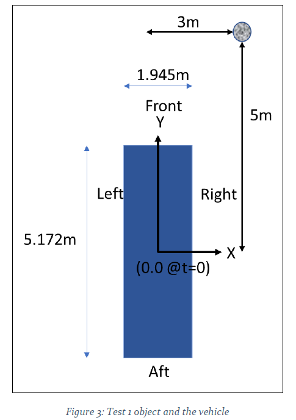
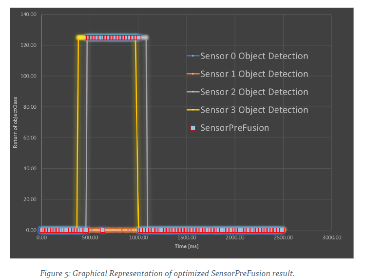
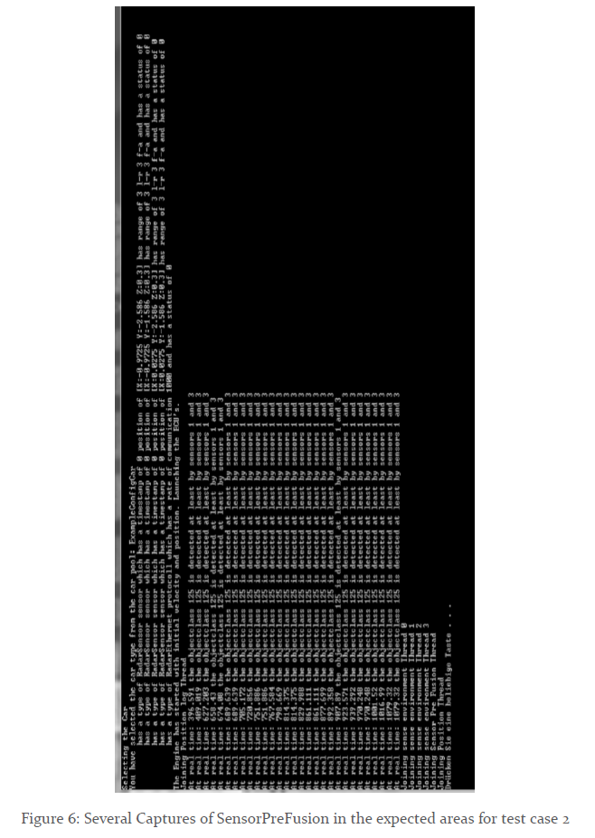

# trivial_sensor_model

## Problem Statement
Each sensor delivers the following information:
- Coordinates of a detected object with respect to the vehicle’s masscenter [Xv, Yv, Zv] in meter as a scaled 16 bit unsigend integer val-ue, scaling factor 1/1000, the default/init value is 0xFFFF
 - timestamp as 32bit unsigned integer, default/init value 0
- objectClass as 8bit unsigned integer, default/init value 0

The “SensorPreFusion” software component shall be triggered every 10ms and reads the sensor signals from a middleware called “Runtime Environment”. If an object has been detected twice in the same location via several sen-sors then the component shall output it’s objectClass and the timestamp of the first appearance. The result shall be written to the middleware. Your job is to implement a first version of the “SensorPreFusion” compo-nent. Your implementation language is C++. Since you are programming a re-al-time system you are looking to optimize your algorithm for run-time. The usage of standard libraries is allowed.

## Introduction and Statutory Declaration
Fort he delivered task, there are in total 510 Lines of “.cpp” content and 330 Lines of
“.h” content is provided for solution. This document consists of results of only
the aforementioned lines of codes. Before starting with the technical details, I
would like to provide hereby the following Statutory Declaration:
“Me, Önay Can have written this code only for the intent of being employed
in AUDI AEV, and have written it only by my own without any aids
including code crawling, copying or receiving similar aids from third or
second parties. I believe confidently that I could provide explanations to
any line or statement to the code if the opportunity is given to do it so.
Kind Regards.”
Special credits goes to the Doxygen (http://www.doxygen.nl/). This tool is used for
the generation of the appendix.

## Tools and Libraries
For this solution the standard libraries provided in Microsoft Visual Studio 2017 are
used. Namely;

```
#include <vector>
#include <map>
#include <iostream>
#include <fstream>
#include <sstream>
#include <string>
#include <chrono>
#include <windows.h>
#include <thread>
```

Since the provided Task is a topic of Real Time Computation, especially the
last three libraries are used for time conversion, duration calculation, sleep
commands and multi-thread programming.

## Illustration of the Framework
Since it is not fully possible to dislocate the focal problem from the macro one, some
thoughts need to be clarified to ensure that the reader is on the same track as the
writer. Figure 1 shows an illustration of the vehicle model.



The mechanical state consists of further modeling issues, namely the sensors. For this
purpose, the sensors are assumed to be placed exactly at the corners of the vehicle and
have a receive-range in form of a quadrilateral. The range spans 3 meters right and 3
meters left, as well as 3 meters front and 3 meters aft. Considering the dimensions of
the vehicle (selected vehicle, you can build your own vehicle in class, please take a look
to the doxygen and delivered code), the range span is in fact covering only very near
environment of the vehicle.


Figure 2 shows an unscaled illustration of the radar sensor positions, numbers (ids)
and the ranges. Please note that the illustration is not scaled.

## Assumptions
The following Assumptions are valid for the solution:
1) The physical Ethernet connection is assumed to be fast enough to ignore
the sleep elapse.
2) The proposed solution is understood as a Human (Developer, tester) in
Loop case. The Driver is taken to be out of the box.
3) Several threads for several objectClasses is not considered, it is assumed
that there is one object at one glance in the environment. (But can be
improved for the code)
4) The objectClasses are assumed to be deterministic, no distribution is
assumed, the size is not considered (nor it is asked). Besides the objects are
stationary. (But this can be improved).
5) DriverAssistence does not deliver feedback.
6) Code runs for a certain time window. Time span, initial position, direction
as well as the vehicle speed can be manipulated from the Human-in-Loop
interface (Driver.cpp -> main)

## Test Cases 
### Test Case -1: Side Object
To simulate this, the following Environment.env content is used:


Which is simply, and object of objectClass 125 with stationary coordinates of 3m on
right, 5m in front and floor. This case can be seen as a tree or traffic light on the right
side of the vehicle.



Figure 3 together with Figure 2 shows that there is an expectation that the sensor
number 2 and 3 can be activated and can capture the object as stated in the problem
formulation: “Twice in the same location via several sensors”

In this example, the vehicle travels with 0.00972222m/ms.
Which will indicate that the CoG of the vehicle will align with the object after 500ms.
Figure 4 shows that exactly sensors 2-3 (as expected) start to capture the object around
486ms. The run of the simulation is 3 seconds (3 seconds car drive), so the
disconnection is also realized after a while.




The red dots in Figure 5 show that apart from a couple of leaks, the red dots are
continuous. This test case assumed to be passed successfully.

### Test Case -2: Front Object
The same object is placed in this time right in front of the vehicle. Since the 3m span
extend better to frontal and rear region, it is expected that the SensorPreFueion
catches the obstacle earlier. Besides, instead of sensor 2, sensor 1 should be active and
sensor 0 should be inactive.



Please consider the doxygen documentation as well. 


